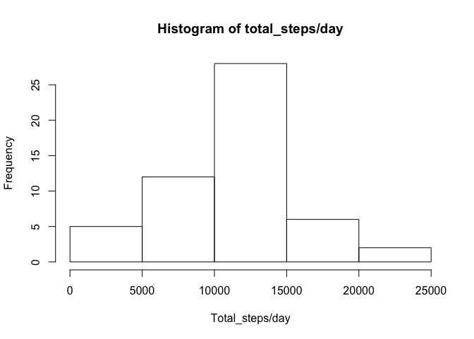
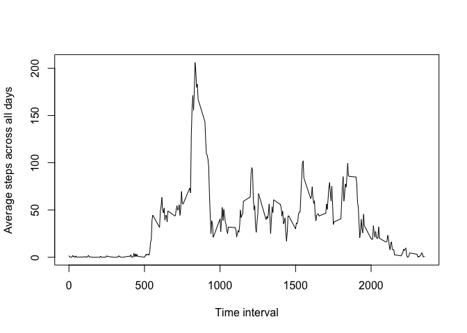
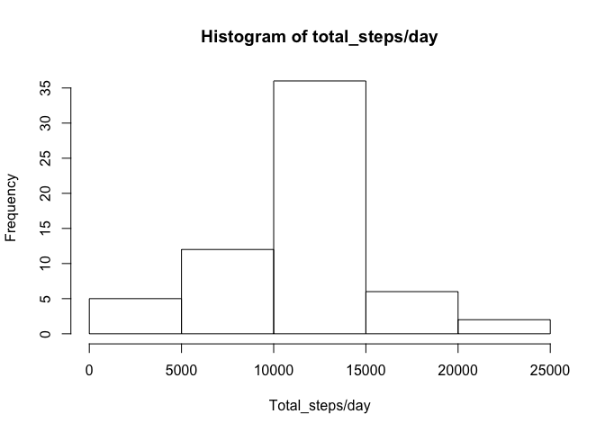
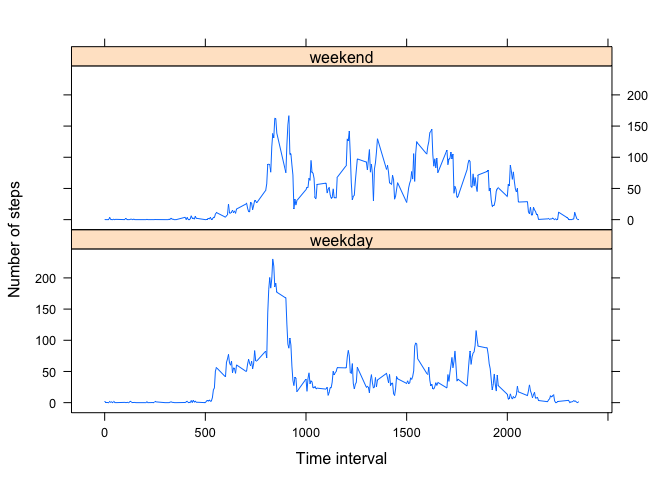

# Reproducible Research: Peer Assessment 1


## Loading and preprocessing the data

```r
activity <- read.csv("activity.csv")
```


## What is mean total number of steps taken per day?
##### (Ignore the missing value in the dataset)
#### 1. Make a histogram of the total number of steps taken each day.
- Calculate the total number of steps taken each day and ignore NAs

```r
library(plyr)
steps_per_day <- ddply(na.omit(activity[,1:2]),.(date),numcolwise(sum)) # Calculate the total number of steps taken each day and ignore NAs
# If na.omit() isn't applied first and use na.rm=T instead, NA sum will become 0, which is not right.
```
- Plot the histogram of the total number of steps taken each day

```r
hist(steps_per_day$steps,main="Histogram of total_steps/day",xlab="Total_steps/day") # Plot the histogram of the total number of steps taken each day
```

 

#### 2. Calculate and report the mean and median total number of steps taken per day
- The mean of the total number of steps taken per day

```r
mean(steps_per_day$steps) # mean
```

```
## [1] 10766.19
```
- The median of the total number of steps taken per day

```r
median(steps_per_day$steps) # median
```

```
## [1] 10765
```

## What is the average daily activity pattern?
#### 1. Make a time series plot (i.e. type = "l") of the 5-minute interval (x-axis) and the average number of steps taken, averaged across all days (y-axis)
- Calculate the average steps across all days for each time interval (NAs are omitted)

```r
avg_steps_int <- ddply(na.omit(activity[,c(1,3)]),.(interval),numcolwise(mean)) # In this case, na.omit at the begining and na.rm=T will do the same job since no time interval has all NAs for all days.
```
- Plot the time series graph: 5-minute interval vs average steps through all days

```r
plot(avg_steps_int$interval,avg_steps_int$steps,type="l",xlab="Time interval",ylab="Average steps across all days")
```

 

#### 2. Which 5-minute interval, on average across all the days in the dataset, contains the maximum number of steps?
- Get the index,i.e. row number, for the maximal average steps across all days in the table of 'avg_steps_int'

```r
ind <- which(avg_steps_int[,2]==max(avg_steps_int$steps))
```
- Get the corresponding 5-minute interval

```r
avg_steps_int[ind,1]
```

```
## [1] 835
```

## Imputing missing values
#### 1. Calculate and report the total number of missing values in the dataset (i.e. the total number of rows with NAs)

```r
length(unique(unlist(lapply(activity, function(x) which(is.na(x)))))) # length(which(is.na(activity))) will give you identical number for this particular case since only activity$steps contains NAs. But in the case of multiple columns have NAs, the 'unique' line will report you rows that contain at least one NA.# Basically, this line will check NAs for each column, record the row number, and find out the unique row numbers.
```

```
## [1] 2304
```
#### 2. Devise a strategy for filling in all of the missing values in the dataset. 

```r
imput.mean <- function(x) replace(x,is.na(x),mean(x,na.rm=T))
# Replace NA in x with mean of x 
```
#### 3. Create a new dataset that is equal to the original dataset but with the missing data filled in.

```r
activity_new <- ddply(activity,.(interval),transform,steps=imput.mean(steps)) # Replace NAs in steps with the mean of steps by interval (i.e. NAs at interval 5 will be replaced by the mean of steps at interval 5.)
activity_new <- activity_new[order(activity_new$date),] # Reorder the new dataset by date
```
#### 4. Make a histogram of the total number of steps taken each day and Calculate and report the mean and median total number of steps taken per day. Do these values differ from the estimates from the first part of the assignment? What is the impact of imputing missing data on the estimates of the total daily number of steps?
- Plot the histogram of the total number of steps taken each day

```r
steps_per_day_new <- ddply(activity_new[,1:2],.(date),numcolwise(sum))
hist(steps_per_day_new$steps,main="Histogram of total_steps/day",xlab="Total_steps/day")
```

 

- - The mean of the total number of steps taken per day

```r
mean(steps_per_day_new$steps) # mean
```

```
## [1] 10766.19
```
- The median of the total number of steps taken per day

```r
median(steps_per_day_new$steps) # median
```

```
## [1] 10766.19
```
- Do these values differ from the estimates from the first part of the assignment?

###### The mean value does not change.The meidan value shifted one step.
- What is the impact of imputing missing data on the estimates of the total daily number of steps?

###### Compare the summary of the dataset before and after filling NAs

```r
summary(steps_per_day$steps,digits=8)
```

```
##     Min.  1st Qu.   Median     Mean  3rd Qu.     Max. 
##    41.00  8841.00 10765.00 10766.19 13294.00 21194.00
```

```r
summary(steps_per_day_new$steps,digits=8)
```

```
##     Min.  1st Qu.   Median     Mean  3rd Qu.     Max. 
##    41.00  9819.00 10766.19 10766.19 12811.00 21194.00
```
###### 1st quantile shifted up, and 3rd quantile shifted down. As a result, the top frequency is lifted up around 10. This means the individual has more total steps per days in the range of 10000 to 15000. 

## Are there differences in activity patterns between weekdays and weekends?
##### Use the dataset with the filled-in missing values for this part.
#### 1. Create a new factor variable in the dataset with two levels -- "weekday" and "weekend" indicating whether a given date is a weekday or weekend day.

```r
activity_new$weekdays <- as.factor(ifelse(weekdays(as.Date(activity_new$date)) %in% c("Saturday","Sunday"), "weekend", "weekday"))
```
#### 2. Make a panel plot containing a time series plot (i.e. type = "l") of the 5-minute interval (x-axis) and the average number of steps taken, averaged across all weekday days or weekend days (y-axis). 

```r
avg_steps_int_new <- ddply(activity_new[,c(1,3,4)],.(interval,weekdays),numcolwise(mean)) # Calculate the average steps across all weekdays and weekends for each time interval
library(lattice)
xyplot(steps ~ interval | weekdays, data=avg_steps_int_new, layout=c(1,2),type="l",xlab="Time interval",ylab="Number of steps")
```

 
